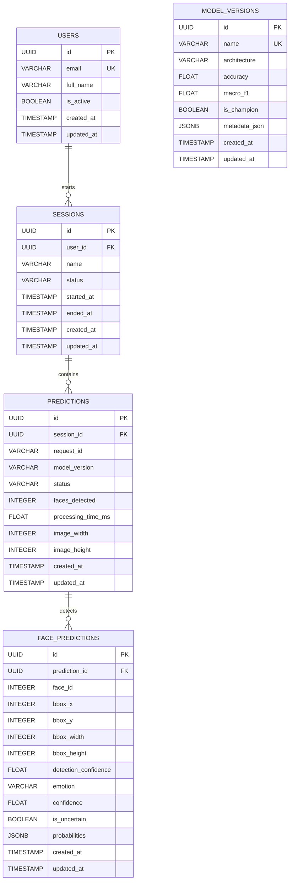

# Database Architecture & Schema Reference

This document details the **PostgreSQL relational database foundation (Phase 10)**, SQLAlchemy 2.x ORM models, Alembic schema migrations, and indexing strategies.

---

## 1. Entity-Relationship (ER) Diagram



---

## 2. Table Schemas & Constraints

### `users`
- `id` (UUID, Primary Key, default `uuid.uuid4`)
- `email` (VARCHAR(255), Unique, Indexed, Nullable)
- `full_name` (VARCHAR(255), Nullable)
- `is_active` (BOOLEAN, default `True`, Not Null)
- `created_at` / `updated_at` (TIMESTAMP WITH TIME ZONE, Server Default `now()`)

### `sessions`
- `id` (UUID, Primary Key, default `uuid.uuid4`)
- `user_id` (UUID, Foreign Key `users.id`, `ON DELETE SET NULL`, Indexed)
- `name` (VARCHAR(255), Nullable)
- `status` (VARCHAR(50), default `'active'`, Indexed, Values: `active`, `completed`, `cancelled`)
- `started_at` (TIMESTAMP WITH TIME ZONE, Server Default `now()`, Indexed)
- `ended_at` (TIMESTAMP WITH TIME ZONE, Nullable)

### `predictions`
- `id` (UUID, Primary Key, default `uuid.uuid4`)
- `session_id` (UUID, Foreign Key `sessions.id`, `ON DELETE CASCADE`, Indexed, Nullable)
- `request_id` (VARCHAR(64), Indexed, Not Null)
- `model_version` (VARCHAR(100), Indexed, Not Null)
- `status` (VARCHAR(50), Not Null, Values: `SUCCESS`, `NO_FACE_DETECTED`, `INVALID_IMAGE`, `ERROR`)
- `faces_detected` (INTEGER, default `0`, Not Null)
- `processing_time_ms` (FLOAT, default `0.0`, Not Null)
- `image_width` / `image_height` (INTEGER, Nullable)

### `face_predictions`
- `id` (UUID, Primary Key, default `uuid.uuid4`)
- `prediction_id` (UUID, Foreign Key `predictions.id`, `ON DELETE CASCADE`, Indexed, Not Null)
- `face_id` (INTEGER, 1-based sequential index within image, Not Null)
- `bbox_x`, `bbox_y`, `bbox_width`, `bbox_height` (INTEGER, pixel coordinates, Not Null)
- `detection_confidence` (FLOAT, Check Constraint: `0.0 <= val <= 1.0`, Not Null)
- `emotion` (VARCHAR(50), Indexed, Not Null, e.g. `happy`, `neutral`, `uncertain`)
- `confidence` (FLOAT, Check Constraint: `0.0 <= val <= 1.0`, Not Null)
- `is_uncertain` (BOOLEAN, default `False`, Not Null)
- `probabilities` (JSON / JSONB, Full 7-class probability map, Not Null)

### `model_versions`
- `id` (UUID, Primary Key)
- `name` (VARCHAR(100), Unique, Indexed, Not Null)
- `architecture` (VARCHAR(100), Not Null)
- `accuracy` / `macro_f1` (FLOAT, Nullable)
- `is_champion` (BOOLEAN, default `False`, Not Null)
- `metadata_json` (JSON / JSONB, Nullable)

---

## 3. Alembic Migrations

Schema evolution is strictly managed via Alembic:

```bash
# Run latest migrations
cd apps/api
alembic upgrade head

# Rollback one migration step
alembic downgrade -1

# Create new migration revision
alembic revision -m "add_new_feature_table"
```

Migration file: `apps/api/alembic/versions/001_initial_phase10_schema.py`.

---

## 4. Supabase Cloud Database & Auth Integration

The system integrates directly with **Supabase** for managed PostgreSQL, authentication, and asset storage:

- **Supabase Project URL**: `https://qnexcdrdvdxdggllanre.supabase.co`
- **Client Provider**: `apps/api/app/integrations/supabase.py` (`get_supabase_client`, `check_supabase_health`)
- **Health Verification**: Checked dynamically via `/api/v1/health` dependency probes.

