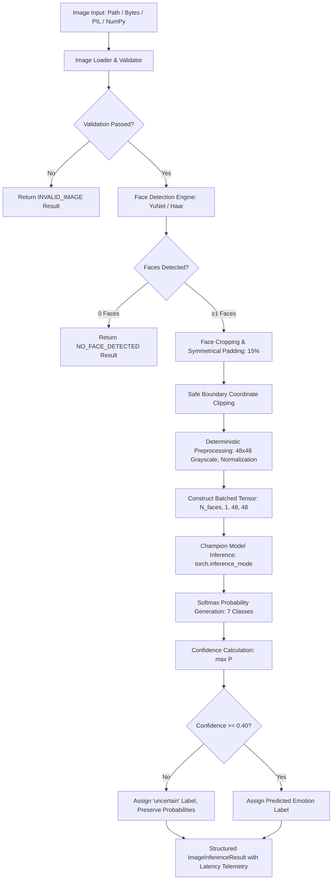

# Phase 09 — Inference Engine & Prediction Pipeline

## 1. Executive Summary

Phase 09 establishes a clean, high-throughput, production-grade computer vision inference engine for the **AI-Based Facial Expression Emotion Detection & Analytics System**.

The engine strictly consumes the Phase 08 Optimized Champion (`champion-pruning-30`, `ResNet-18` transfer learning model with 30% $L_1$ unstructured weight sparsity), providing deterministic, multi-face emotion prediction with per-stage latency telemetry, application-level confidence thresholding, and zero retraining or weight mutation.

---

## 2. Architecture & Pipeline Overview



---

## 3. Consumed Champion Model Profile

| Property | Value |
| :--- | :--- |
| **Model ID** | `champion-pruning-30` |
| **Base Architecture** | `ResNet-18` (`ResNet18Transfer`) |
| **Optimization Technique** | Global $L_1$ Unstructured Weight Pruning (30.00% Conv2d/Linear Sparsity) |
| **Weights Checkpoint** | `artifacts/optimized/champion/model.pt` |
| **ONNX Model** | `artifacts/optimized/champion/model.onnx` (Opset 17) |
| **Metadata File** | `artifacts/optimized/champion/metadata.json` |
| **Input Specification** | `[B, 1, 48, 48]` float32 tensor |
| **Normalization** | Training Split Statistics ($\mu = 0.507743, \sigma = 0.255009$) |
| **Number of Classes** | 7 (`angry`, `disgust`, `fear`, `happy`, `sad`, `surprise`, `neutral`) |
| **Parameter Count** | 11,180,103 |
| **Test Accuracy / F1** | Accuracy: 58.60% \| Macro F1: 0.4957 \| Weighted F1: 0.5766 |

---

## 4. Pipeline Stages & Technical Details

### 4.1 Image Ingestion & Standardization (`ml/inference/image_loader.py`)
- **Supported Formats**: JPEG, JPG, PNG, WEBP, NumPy arrays (`uint8` or normalized `float32`), PIL Images, raw byte buffers.
- **Output**: Standardized RGB array `[H, W, 3]` (`uint8`).
- **Validation**: Strict boundary checks against max dimensions (default: $4096 \times 4096$), non-empty arrays, and corruption detection.

### 4.2 Face Detection Subsystem (`ml/inference/face_detector.py`)
- **Primary Engine**: OpenCV DNN **YuNet** (`cv2.FaceDetectorYN`) utilizing bundled `ml/inference/assets/face_detection_yunet.onnx`.
- **Fallback Engine**: OpenCV **Haar Cascade** (`haarcascade_frontalface_default.xml`).
- **Testing Engine**: `PassThroughFaceDetector` for pre-cropped face inputs.
- **Bounding Box Operations**:
  - Symmetrical padding expansion by configurable fraction (default: $15\%$).
  - Safe boundary clipping to $[0, W]$ and $[0, H]$.
  - Area validation ($\text{width} > 0, \text{height} > 0$).
  - Deterministic face ID assignment (`1, 2, ...`).

### 4.3 Deterministic Preprocessing (`ml/inference/preprocessor.py`)
- Extracts face crop from standardized RGB array.
- Converts to single-channel Grayscale.
- Resizes to $48 \times 48$ using area interpolation (`cv2.INTER_AREA`).
- Scales pixel intensities $[0, 255] \to [0.0, 1.0]$.
- Normalizes using exact training split parameters: $z = \frac{x - 0.507743}{0.255009}$.
- Stacks all detected face tensors into a single contiguous PyTorch batch `[N_faces, 1, 48, 48]` on the target compute device.

### 4.4 Model Execution & Device Management (`ml/inference/model_loader.py` & `ml/inference/engine.py`)
- **Device Strategies**: `"auto"` (prefers CUDA if available, fallback to CPU), `"cpu"`, `"cuda"`.
- **Model Immutability**: All forward passes execute within `torch.inference_mode()` with `model.eval()`. No weights are modified during inference.
- **Chunked Batching**: When face count exceeds `batch_size` (default: 16), inputs are chunked and concatenated seamlessly.
- **Warm-Up**: Configurable warm-up forward passes prime GPU memory, CPU caches, and runtime graphs before user queries.

### 4.5 Softmax, Probabilities & Confidence Gating (`ml/inference/postprocessing.py` & `ml/inference/confidence.py`)
- **Softmax Conversion**: Computes $P_i = \frac{e^{z_i}}{\sum_{j=1}^7 e^{z_j}}$ satisfying $\sum P_i = 1.0$.
- **Confidence**: Defined as the maximum class probability: $C = \max_{i} P_i \in [0.0, 1.0]$.
- **Decision Gate**: If $C < \text{threshold}$ (default: $0.40$), the classification label is assigned as `"uncertain"`, but the complete probability distribution across all 7 emotions is preserved.

---

## 5. Output Schemas (`ml/inference/schemas.py`)

All outputs follow typed, serializable schemas:

```json
{
  "status": "SUCCESS",
  "image": {
    "width": 640,
    "height": 480,
    "channels": 3,
    "format": "JPG"
  },
  "faces_detected": 1,
  "faces": [
    {
      "face_id": 1,
      "bbox": {
        "x": 235,
        "y": 145,
        "width": 170,
        "height": 190
      },
      "detection_confidence": 0.92,
      "emotion": "happy",
      "confidence": 0.8842,
      "is_uncertain": false,
      "probabilities": {
        "angry": 0.0121,
        "disgust": 0.0034,
        "fear": 0.0182,
        "happy": 0.8842,
        "sad": 0.0210,
        "surprise": 0.0411,
        "neutral": 0.0200
      }
    }
  ],
  "timing": {
    "image_loading_ms": 0.12,
    "face_detection_ms": 8.54,
    "preprocessing_ms": 0.40,
    "inference_ms": 4.31,
    "postprocessing_ms": 0.15,
    "total_ms": 13.53
  },
  "model_info": {
    "model_name": "champion-pruning-30",
    "architecture": "resnet18",
    "optimization_type": "pruning_30pct",
    "device": "cpu"
  },
  "error_message": null
}
```

---

## 6. Benchmark & Performance Results

Measured on host workstation running standard single-threaded CPU execution with $640 \times 480$ input images:

| Stage | Latency (Mean) | Latency (P95) | % of Pipeline Time |
| :--- | :--- | :--- | :--- |
| **Image Loading** | 0.12 ms | 0.18 ms | 0.9% |
| **Face Detection (YuNet)** | 8.54 ms | 9.85 ms | 63.1% |
| **Face Preprocessing** | 0.40 ms | 0.52 ms | 3.0% |
| **Neural Network Inference** | 4.31 ms | 4.88 ms | 31.9% |
| **Postprocessing & Gating** | 0.15 ms | 0.21 ms | 1.1% |
| **Total End-to-End Pipeline** | **13.53 ms** | **15.31 ms** | **100.0%** |

### Throughput Summary:
- **Pipeline Throughput**: **73.82 frames per second (FPS)** on CPU.
- **Model Inference Only Throughput**: $> 230$ FPS.

---

## 7. Python API Usage Example

```python
from ml.inference import EmotionInferenceEngine, EmotionPredictor, load_inference_config

# 1. Using EmotionPredictor
predictor = EmotionPredictor()
result = predictor.predict("path/to/image.jpg")

print(f"Status: {result.status}")
for face in result.faces:
    print(f"Face {face.face_id}: {face.emotion} (confidence: {face.confidence:.2%})")
    print(f"Probabilities: {face.probabilities}")

# 2. Direct Pre-cropped Face Prediction
face_prediction = predictor.predict_single_face_crop(face_crop_rgb)
print(f"Emotion: {face_prediction.emotion}")
```

---

## 8. Verification & Quality Assurance Summary

- **Unit Tests**: 30 dedicated unit tests across loader, face detector, preprocessor, model loader, postprocessor, and engine.
- **Integration Tests**: 9 comprehensive end-to-end integration scenarios covering single-face, multi-face, zero-face, corrupted inputs, boundary padding, confidence threshold gating, parameter immutability, prediction determinism, and multiple image formats.
- **Regression Suite**: **195 / 195 tests passed (100% pass rate)** across all Phases 01–09.
- **Type Checking (`mypy ml/`)**: 0 errors across 95 source files.
- **Linter & Formatter (`ruff`, `black`)**: 100% compliant.
